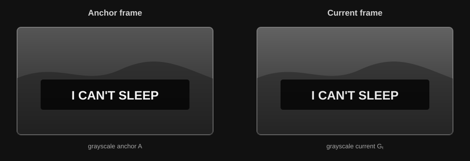

# SRT Getter

This project extracts subtitles from video with a hybrid Go + Python workflow:

- React provides video selection, frame preview, crop selection, settings, progress, and results.
- Go manages the job lifecycle, communicates with the Python worker, supports cancellation, and exports SRT.
- Python uses OpenCV for fast frame analysis and EasyOCR for text recognition.


## Core idea

The expensive operation is OCR. Running OCR on every sampled frame wastes GPU time because the same subtitle may remain on screen for many frames. This project separates the problem into two stages:

1. Use lightweight image math to find when a subtitle starts and ends.
2. Run OCR once per detected subtitle segment, using GPU batches.

This means the system does not ask OCR to solve a timing problem that can be handled cheaply with pixel comparison.

## Subtitle detection workflow

For a video of duration `T`, the main loop samples frames at `step_sec`:

```text
video → sample frame → crop subtitle region → has_text()
                                      ├─ no candidate → next sample
                                      └─ candidate → find t_end() → OCR batch
```

The scan loop and OCR run as overlapping pipeline stages. Once a crop batch is submitted to the OCR worker, the main loop continues with `has_text()`, frame scanning, and `find_t_end()` instead of waiting for OCR to finish:

$$
T_{serial} = T_{scan} + T_{ocr}
$$

$$
T_{pipeline} \approx \max(T_{scan}, T_{ocr})
$$

Because OCR is usually much slower than `has_text()`, the fast detection work is largely hidden inside the OCR time. This is a small optimization, but it prevents the scan loop from unnecessarily blocking on each OCR batch.

### 1. Crop the configured region

The frontend returns normalized coordinates:

```text
crop_box = (x_min, x_max, y_min, y_max)
```

Each value is between `0` and `1`. For a frame of width `W` and height `H`:

```text
x_start = W × x_min
x_end   = W × x_max
y_start = H × y_min
y_end   = H × y_max
```

Only this region is used by the detection and OCR stages.

### 2. Cheap candidate filtering with `has_text()`

`SubtitleOCR.has_text()` is a lightweight OpenCV filter. It does not run EasyOCR. It combines:

- grayscale conversion;
- a bright-pixel mask;
- Canny edges;
- morphological closing;
- active-row counting.

Frames that clearly contain no text are discarded before the timing comparison and OCR stages.

### 3. Capture the anchor frame

When a candidate is found at `t_start`, its crop becomes the anchor image `A`:

```text
A = anchor crop at t_start
```

The anchor is the visual reference for the rest of that subtitle segment.

### 4. Build the anchor edge signature

`MathEngine.compute_anchor_signature()` converts the anchor to grayscale and extracts its edges:

$$
G_A = Gray(A)
$$

$$
E_A = Canny(G_A, 100, 200)
$$

`E_A` is a binary mask representing important edges, usually the strokes and outlines of the subtitle text. The number of edge pixels is also counted:

$$
N_E = \sum_{x,y} E_A(x,y)
$$

If `N_E < 10`, the anchor has too little visual information and is rejected as unstable.

### 5. Compare each following frame without OCR

For a later crop `F_t`, the algorithm first converts it to grayscale:

$$
G_t = Gray(F_t)
$$

Then it computes the absolute pixel difference:

$$
D_t(x,y) = |G_A(x,y) - G_t(x,y)|
$$

With the current threshold `τ = 20`, a pixel is considered stable when its difference is small enough:

$$
M_t(x,y) =
\begin{cases}
1 & \text{if } D_t(x,y) \le 20 \\
0 & \text{otherwise}
\end{cases}
$$

The two grayscale subtitle crops being compared should look like this:



The comparison is restricted to the anchor edge mask. This avoids treating the whole video background as subtitle evidence:

$$
S_t = \frac{\sum_{x,y} E_A(x,y) \cdot M_t(x,y)}{\sum_{x,y} E_A(x,y)}
$$

`S_t` is the stable edge ratio.

The current decision rule is:

```text
S_t > 0.40  → subtitle is still present
S_t ≤ 0.40  → subtitle has changed or disappeared
```

`_find_t_end()` evaluates this every `boundary_step` seconds, defaulting to `0.1s`. When the ratio drops below the threshold, the previous stable timestamp becomes `t_end`.

### 6. Run OCR only after timing is known

Once `(t_start, t_end, anchor_crop)` is known, the crop is added to `pending_ocr`. The OCR call is delayed until the batch is full or the video ends.

The current default batch size is `8`:

```text
pending crops → readtext_batched() → confidence filter → reading order → subtitle result
```

The final result has this shape:

```json
{
  "start": 12.2,
  "end": 14.0,
  "text": "Example subtitle"
}
```

## Why this reduces OCR time

Let:

- `N` = number of sampled frames;
- `K` = number of detected subtitle segments;
- `B` = OCR batch size, currently `8`;
- `C_ocr` = cost of one OCR operation;
- `C_math` = much cheaper grayscale/diff/edge comparison cost.

A naive approach that runs OCR on every sampled frame costs approximately:

$$
T_{naive} \approx N \cdot C_{ocr}
$$

The current workflow costs approximately:

$$
T_{current} \approx N \cdot C_{math} + \left\lceil\frac{K}{B}\right\rceil \cdot C_{ocr}
$$

Because normally `K << N` and `C_math << C_ocr`, the GPU does far fewer expensive recognition calls. A representative application time allocation is:

| Stage | Share |
|---|---:|
| Frame positioning (`position`) | 0.8% |
| Fast text candidate filter (`has_text`) | 0.7% |
| Subtitle end detection (`find_t_end`) | 12.7% |
| GPU OCR (`read_text`) | 85.8% |
| **Total** | **100%** |

This profile shows why OCR batching and avoiding OCR on every frame matter most. The exact proportions vary with video resolution, GPU, subtitle density, and EasyOCR settings, but the same pattern is expected: `read_text` is the dominant cost, while frame positioning and math-based filtering remain relatively cheap.

## Project structure

```text
subtitle/
├─ engine/
│  ├─ worker.py              # Persistent JSON-lines worker
│  ├─ algorithm.py           # Video scan and subtitle timing
│  ├─ math_engine.py         # Grayscale, edge, and matrix comparison
│  └─ models/ocr_engine.py   # EasyOCR and preprocessing
├─ frontend/
│  └─ src/App.tsx            # React workflow UI
├─ app.go                    # Wails methods and job state
├─ worker.go                 # Go ↔ Python process bridge
└─  srt.go                   # SRT formatting and saving

```
## Installation

The project currently targets Windows with an NVIDIA GPU and CUDA-enabled PyTorch.

Prerequisites:

- Go 1.23 or newer;
- Node.js and npm;
- Python 3.13;
- Microsoft Edge WebView2 Runtime;
- NVIDIA driver and a CUDA-compatible PyTorch installation.

From the project root:

```powershell
python -m venv .venv
.\.venv\Scripts\Activate.ps1
python -m pip install --upgrade pip
```

Install a CUDA-enabled PyTorch build that matches the machine. For the current CUDA 12.8 environment, the command is:

```powershell
python -m pip install torch --index-url https://download.pytorch.org/whl/cu128
```

Then install the remaining Python dependencies:

```powershell
python -m pip install -r engine\requirements.txt
```

Install frontend dependencies:

```powershell
cd frontend
npm install
cd ..
```

If Python is installed somewhere else, set its path before running the app:

```powershell
$env:SUBTITLE_PYTHON = "C:\Path\To\python.exe"
```

## Run without a production build

You do not need to build `subtitle-studio.exe` during development. Run Wails development mode from the project root:

```powershell
go run github.com/wailsapp/wails/v2/cmd/wails@v2.13.0 dev
```

This starts the React development server, compiles the Go backend on demand, opens the Wails development window, and enables frontend hot reload.

To run the Go app directly with the already-built frontend assets:

```powershell
go run .
```

To inspect only the Python worker protocol in a terminal:

```powershell
.\.venv\Scripts\python.exe -u engine\worker.py
```

The worker expects JSON-lines commands on stdin. The desktop app normally sends these commands through Go.

## Production build

When a standalone executable is needed:

```powershell
go run github.com/wailsapp/wails/v2/cmd/wails@v2.13.0 build
```

The executable is written to `build/bin`. It still needs access to the `engine` directory and the Python environment, unless `SUBTITLE_PYTHON` is configured separately.

## Notes

This project was not originally intended to become a full application. It started as a learning project focused on Python, OCR, image processing, and workflow optimization. The current interface is a quick prototype assembled with the help of AI. If you find a bug or unexpected behavior, please open an issue.
